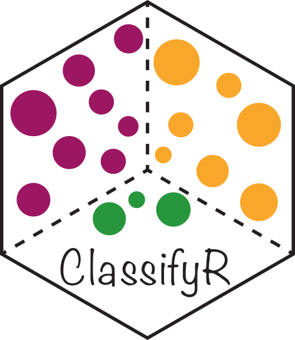

```{r, include = FALSE}
knitr::opts_chunk$set(
  collapse = TRUE,
  comment = "#>"
)
```

Farhan Ameen, Alex Qin, Nick Robertson, Sourish Iyengar, Ellis Patrick$^{1,2,3}$.
    
$^1$ Westmead Institute for Medical Research, University of Sydney, Australia  
$^2$ Sydney Precision Data Science Centre, University of Sydney, Australia  
$^3$ School of Mathematics and Statistics, University of Sydney, Australia
  
<br/>
contact: ellis.patrick\@sydney.edu.au

```{r htmlTemplate, echo=FALSE}
# Create the external file
img <- htmltools::img(src = knitr::image_uri("../inst/images/Statial.png"), 
               alt = 'logo', 
               style = 'position:absolute; top:50px; right:1%; padding:10px;z-index:200;max-width: 15%; border: 0px')

htmlhead <- paste0('
<script>
document.write(\'<div class="logos">',img,'</div>\')
</script>
')

readr::write_lines(htmlhead, file = "header.html")

```


## Overview

There are over 37 trillion cells in the human body, each taking up different forms and functions. The behaviour of these cells can be described by canonical characteristics, but their functions can also dynamically change based on their environmental context, leading to cells with diverse states. Understanding changes in cell state related to their spatial context in the tissue microenvironment is key to understanding how spatial interactions between cells can contributes to human disease. State-of-the-art technologies such as PhenoCycler, IMC, CosMx, Xenium, MERFISH and many others have made it possible to deeply phenotype characteristics of cells in their native environment. This has created the exciting opportunity to identify spatially related changes in cell state in a high-thoughput manner.

## Description

Statial is a Bioconductor package which contains a suite of complementary approaches for identifying changes in cell state and how these changes are associated with cell type localisation. This workshop will introduce new functionality in the Statial package which can  

  1) uncover changes in marker expression associated with cell proximities and 
  2) model spatial relationships between cells in the context of hierarchical cell lineage structures. 
  3) identify changes in cell state between distinct tissue environments,

### Pre-requisites

It is expected that students will have:

* basic knowledge of R syntax,
* familiarity with SingleCellExperiment and/or SpatialExperiment objects, and
* this workshop will not provide an in-depth description of cell-resolution spatial omics technologies. 


### Participation

While it will be possible for participantsto run code as we go through the demonstration, given time constraints, I would encourage them to focus their attention into critiquing when and why modelling the spatial relationships between cells in these ways is appropriate. Questions are welcome both within the workshop and if students choose to workthrough the workshop independently after the demonstration.

### _R_ / _Bioconductor_ packages used

While this workshop will focus on the functionality of Statial, it will tangentially touch on other Bioconductor packages we have developed for these technologies such as [spicyR](https://www.bioconductor.org/packages/release/bioc/html/spicyR.html), [lisaClust](https://www.bioconductor.org/packages/release/bioc/html/lisaClust.html) and [ClassifyR](https://www.bioconductor.org/packages/release/bioc/html/ClassifyR.html).


  


### Time outline

An example for a 45-minute workshop:

| Activity                     | Time |
|------------------------------|------|
| Packages                     | 15m  |
| Package Development          | 15m  |
| Contributing to Bioconductor | 5m   |
| Best Practices               | 10m  |

### Workshop goals and objectives

#### Learning goals


* identify methods which align with spatial hypothese of interest.
* understand the difference between the approaches and when they will be appropriate.
* appreciate the limitations of the differences approaches and when they will be uninformative.

#### Learning objectives

* apply functions to identify various types of changes in cell state.
* interpret output from tests and quantifications.
* evaluate the appropriateness of different analytical approaches.
* assess the performance of classification approaches that utilise cell state features.

## Workshop


