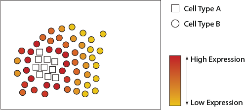
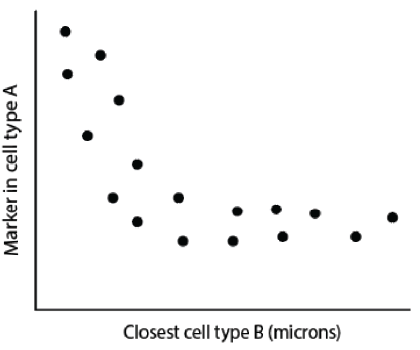

```{r, include = FALSE}
knitr::opts_chunk$set(
  collapse = TRUE,
  comment = "#>"
)
```


Farhan Ameen, Alex Qin, Nick Robertson, Sourish Iyengar, Shila Ghazanfar, Ellis Patrick$^{1,2,3}$.

$^1$ Westmead Institute for Medical Research, University of Sydney, Australia\
$^2$ Sydney Precision Data Science Centre, University of Sydney, Australia\
$^3$ School of Mathematics and Statistics, University of Sydney, Australia

<br/> contact: ellis.patrick\@sydney.edu.au


## Overview

There are over 37 trillion cells in the human body, each taking up different forms and functions. The behaviour of these cells can be described by canonical characteristics, but their functions can also dynamically change based on their environmental context, leading to cells with diverse states. Understanding changes in cell state related to their spatial context in the tissue microenvironment is key to understanding how spatial interactions between cells can contributes to human disease. State-of-the-art technologies such as PhenoCycler, IMC, CosMx, Xenium, MERFISH and many others have made it possible to deeply phenotype characteristics of cells in their native environment. This has created the exciting opportunity to identify spatially related changes in cell state in a high-throughput manner.

## Description

Statial is a Bioconductor package which contains a suite of complementary approaches for identifying changes in cell state and how these changes are associated with cell type localisation. This workshop will introduce new functionality in the Statial package which can

1)  uncover changes in marker expression associated with cell proximities and
2)  model spatial relationships between cells in the context of hierarchical cell lineage structures.
3)  identify changes in cell state between distinct tissue environments,

### Pre-requisites

It is expected that students will have:

-   basic knowledge of R syntax,
-   familiarity with SingleCellExperiment and/or SpatialExperiment objects, and
-   this workshop will not provide an in-depth description of cell-resolution spatial omics technologies.

### Participation

While it will be possible for participants to run code as we go through the demonstration, given time constraints, I would encourage them to focus their attention into critiquing when and why modelling the spatial relationships between cells in these ways is appropriate. Questions are welcome both within the workshop and if students choose to workthrough the workshop independently after the demonstration.

### *R* / *Bioconductor* packages used

While this workshop will focus on the functionality of Statial, it will tangentially touch on other Bioconductor packages we have developed for these technologies such as [spicyR](https://www.bioconductor.org/packages/release/bioc/html/spicyR.html), [lisaClust](https://www.bioconductor.org/packages/release/bioc/html/lisaClust.html) and [ClassifyR](https://www.bioconductor.org/packages/release/bioc/html/ClassifyR.html).

  

### Time outline

An example for a 45-minute workshop:

| Activity                     | Time |
|------------------------------|------|
| Packages                     | 15m  |
| Package Development          | 15m  |
| Contributing to Bioconductor | 5m   |
| Best Practices               | 10m  |

### Workshop goals and objectives

#### Learning goals

-   identify methods which align with spatial hypothese of interest.
-   understand the difference between the approaches and when they will be appropriate.
-   appreciate the limitations of the differences approaches and when they will be uninformative.

#### Learning objectives

-   apply functions to identify various types of changes in cell state.
-   interpret output from tests and quantifications.
-   evaluate the appropriateness of different analytical approaches.
-   assess the performance of classification approaches that utilise cell state features.

## Workshop

### Load packages
```{r, warning=FALSE, message=FALSE}

library(Statial)
library(spicyR)
library(lisaClust)
library(ClassifyR)
library(ggplot2)
library(SpatialExperiment)
library(dplyr)
library(tidyr)

```


The definitions of cell types and cell states are somewhat ambiguous. We will purposefully skirt the debate of what is a cell type vs cell state. Instead, in this workshop I would ask participants to associate *cell state* terminology to simply mean a varying phenotype (*state*) of a large cluster of similar cells (*cell type*). In this workshop we will examine two analytically distinct changes in cell state:

1.  *A continuous change in state.* The state of a cell type is defined by variation in abundance of a gene or protein.\
2.  *A discrete change in state.* Cell types (clusters of cells) are further clustered into sub-clusters. These finer-resolution phenotypes of the cell type are labelled as cell states.

### Identifying continuous changes in cell state

Changes in cell states can be analytically framed as the change in abundance of a gene or protein within a particular cell type. We can look to see if a cell type changes state when in close proximity to another cell type. In the figures below we see the abundance of a particular marker increased in circle cells that are closer to square cells.

 

We can use Statial to quantify and test for these types of relationships.

#### A change in state within a single image.

###### Code to run for everything (e.g. don't specify for relationships)

###### Which interactions don't make sense

###### Marker contamination from lateral spillover

##### Correcting for lateral spillover with cell type deconvolution.

Show that it helps. \##### ROC curve showing contamination calculation works (somewhat)

#### Identify change in state consistent across images.

##### Mixed model

#### Associate these changes with a patient outcome

##### ProportionalHazards Models

##### Generate imageModels and see if the image features are associated with survival with spicyR::colTest

### Identifying continuous changes in cell state within spatial domains

We can look at changes of cell state relative to membership of different spatial domains. These domains can represent distinct tissue microenvironments where cells will potentially be interacting with different types cells.


Here we see the abundance of a marker being higher in cell type 2 within spatial region 1 than spatial region 2.

####LISACLUST

### Identify spatial domains with lisaClust

## Test between spatial domains

## Associate with a patient outcome

### Identifying discrete changes in cell state with Kontextual

Reiterate the approach


We introduce Kontextual


For the purposes of using `Kontextual` we treat cell states as identified clusters of cells, where larger clusters represent a "parent" cell population, and finer sub-clusters representing a "child" cell population. For example a CD4 T cell may be considered a child to a larger parent population of Immune cells. `Kontextual` thus aims to see how a child population of cells deviate from the spatial behaviour of their parent population, and how that influences the localisation between the child cell state and another cell state.

#### Identify within a single image

## Identify across images

## Associate with a patient outcome

We might need to add coxph tests to the colTest function. Nick could potentially help with this. If not, for-loop it.

# Predicting patient outcomes

## Extract feature sets

## Run classifyR
