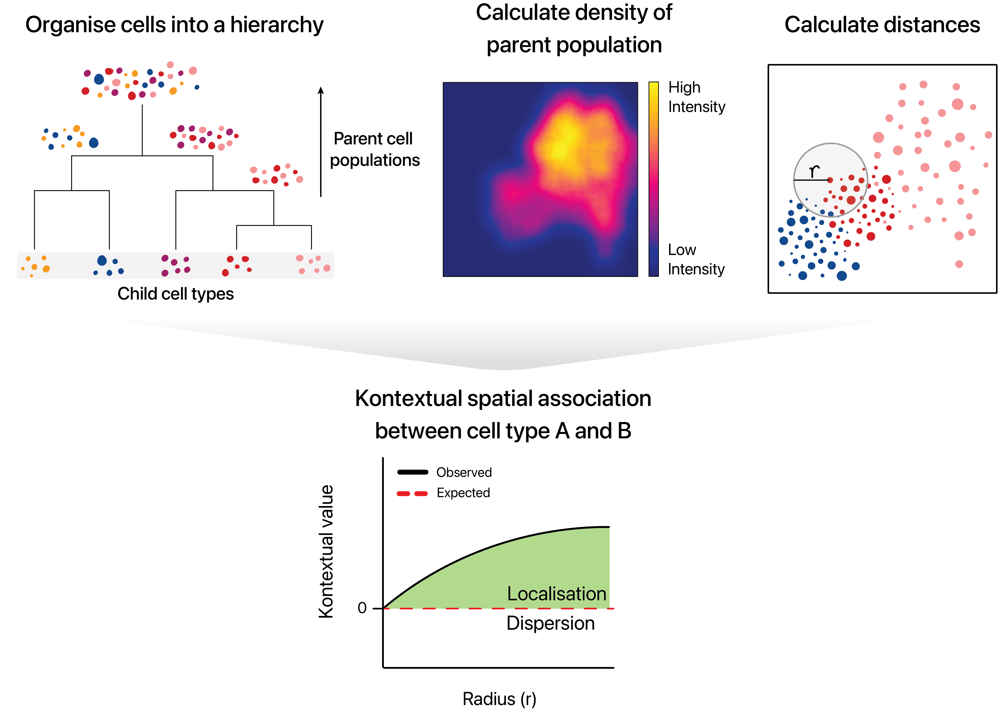

```{=html}
<style>
.question {
  padding: 1em;
  background: lightcyan;
  color: black;
  border-radius: 10px;
}
</style>
```
```{r, include = FALSE}
knitr::opts_chunk$set(
  collapse = TRUE,
  comment = "#>",
  cache = TRUE
)
```


Farhan Ameen, Alex Qin, Nick Robertson, Sourish Iyengar, Shila Ghazanfar, Ellis Patrick$^{1,2,3}$.

$^1$ Westmead Institute for Medical Research, University of Sydney, Australia\
$^2$ Sydney Precision Data Science Centre, University of Sydney, Australia\
$^3$ School of Mathematics and Statistics, University of Sydney, Australia

<br/> contact: ellis.patrick\@sydney.edu.au

## Overview

There are over 37 trillion cells in the human body, each taking up different forms and functions. The behaviour of these cells can be described by canonical characteristics, but their functions can also dynamically change based on their environmental context, leading to cells with diverse states. Understanding changes in cell state related to their spatial context in the tissue microenvironment is key to understanding how spatial interactions between cells can contributes to human disease. State-of-the-art technologies such as PhenoCycler, IMC, CosMx, Xenium, MERFISH and many others have made it possible to deeply phenotype characteristics of cells in their native environment. This has created the exciting opportunity to identify spatially related changes in cell state in a high-thoughput manner.

## Description

Statial is a Bioconductor package which contains a suite of complementary approaches for identifying changes in cell state and how these changes are associated with cell type localisation. This workshop will introduce new functionality in the Statial package which can

1)  uncover changes in marker expression associated with cell proximities and
2)  model spatial relationships between cells in the context of hierarchical cell lineage structures.
3)  identify changes in cell state between distinct tissue environments,

### Pre-requisites

It is expected that students will have:

-   basic knowledge of R syntax,
-   familiarity with SingleCellExperiment and/or SpatialExperiment objects, and
-   this workshop will not provide an in-depth description of cell-resolution spatial omics technologies.

### Participation

While it will be possible for participantsto run code as we go through the demonstration, given time constraints, I would encourage them to focus their attention into critiquing when and why modelling the spatial relationships between cells in these ways is appropriate. Questions are welcome both within the workshop and if students choose to workthrough the workshop independently after the demonstration.

### *R* / *Bioconductor* packages used

While this workshop will focus on the functionality of Statial, it will tangentially touch on other Bioconductor packages we have developed for these technologies such as [spicyR](https://www.bioconductor.org/packages/release/bioc/html/spicyR.html), [lisaClust](https://www.bioconductor.org/packages/release/bioc/html/lisaClust.html) and [ClassifyR](https://www.bioconductor.org/packages/release/bioc/html/ClassifyR.html).

  

### Time outline

An example for a 45-minute workshop:

| Activity                     | Time |
|------------------------------|------|
| Packages                     | 15m  |
| Package Development          | 15m  |
| Contributing to Bioconductor | 5m   |
| Best Practices               | 10m  |

### Workshop goals and objectives

#### Learning goals

-   identify methods which align with spatial hypothese of interest.
-   understand the difference between the approaches and when they will be appropriate.
-   appreciate the limitations of the differences approaches and when they will be uninformative.

#### Learning objectives

-   apply functions to identify various types of changes in cell state.
-   interpret output from tests and quantifications.
-   evaluate the appropriateness of different analytical approaches.
-   assess the performance of classification approaches that utilise cell state features.

## Workshop

### Load packages

```{r, warning=FALSE, message=FALSE}

library(StatialBioc2023)
library(Statial)
library(spicyR)
library(lisaClust)
library(ClassifyR)
library(ggplot2)
library(SpatialExperiment)
library(dplyr)
library(tidyr)

theme_set(theme_classic())
nCores <- 1  # Feel free to parallelise things if you have the cores to spare.

```

The definitions of cell types and cell states are somewhat ambiguous. We will purposefully skirt the debate of what is a cell type vs cell state. Instead, in this workshop I would ask participants to associate *cell state* terminology to simply mean a varying phenotype (*state*) of a large cluster of similar cells (*cell type*). In this workshop we will examine two analytically distinct changes in cell state:

1.  *A continuous change in state.* The state of a cell type is defined by variation in abundance of a gene or protein.\
2.  *A discrete change in state.* Cell types (clusters of cells) are further clustered into sub-clusters. These finer-resolution phenotypes of the cell type are labelled as cell states.

### The data

To illustrate the functionality of Statial we will use a multiplexed ion beam imaging by time-of-flight (MIBI-TOF) dataset profiling tissue from triple-negative breast cancer patients\^1. This subset of the MIBI-TOF data simultaneously quantifies *in situ* expression of 36 proteins in 31 immune rich patients. *Note:* The data contains some "uninformative" probes and the original cohort included 41 patients.

The data is stored in a `SpatialExperiment` object called `kerenSPE`. We can load the data and view some basic characteristics.

```{r}
data("kerenSPE")
kerenSPE
```

As our data is stored in a `SpatialExperiment`, with the `spatialCoords` also stored as a `reducedDim`, we can use `scater` to visualise our data in a lower dimensional embedding and look for image or cluster differences.

```{r, fig.width=5, fig.height=4}

# Perform dimension reduction using UMAP.
# I have already run this and saved it in kerenSPE so that you can save time.
#
# set.seed(51773)
# kerenSPE <- scater::runUMAP(kerenSPE, exprs_values = "intensities", name = "UMAP")

# UMAP by imageID.
scater::plotReducedDim(kerenSPE, dimred = "UMAP", colour_by = "cellType")
```

::: question
**Question**

1.  What does this UMAP tell us?
2.  What are some observations we could make if we coloured by `imageID`?
:::

### Identifying discrete changes in cell state with Kontextual

Cells states can be modelled as subclusters of a broader parent cell population. These subclusters, or states, are typically identified via a hierarchical clustering strategy. By framing cell states as discrete clusters, we are able to explore relationships as follows - cell type A has two states, with state 2 being closer to cell type B.


Here we introduce Kontextual. Kontextual models spatial relationships between cells in the context of hierarchical cell lineage structures. By assessing spatial relationships between pairs of cells in the context of other related cell types, Kontextual provides robust quantification of cell type relationships which are invariant to changes in tissue structure.



For the purposes of using `Kontextual` we treat cell states as identified clusters of cells, where larger clusters represent a "parent" cell population, and finer sub-clusters representing a "child" cell population. For example a CD4+ T cell may be considered a child to a larger parent population of T cells. `Kontextual` thus aims to quantify how the localisation patterns of a child population of cells deviate from the spatial behaviour of their parent population, and how that influences the localisation between the child cell state and another cell state.

#### Cell type hierarchy

A key input for Kontextual is an annotation of cell type hierarchies. We will need these to organise all the cells present into cell state populations or clusters, e.g. all the different B cell types are put in a vector called bcells.

To make our lives easier, we will start by defining these here. I'm happy to talk about how we use our bioconductor package [treekoR](http://www.bioconductor.org/packages/release/bioc/html/treekoR.html) to define these hierarchies in a data driven way.

```{r}
# Set up cell populations

tumour <- c("Keratin_Tumour", "Tumour")

bcells <- c("B_cell")
tcells <- c("dn_T_cell", "CD4_T_cell", "CD8_T_cell", "Tregs")
myeloid <- c("Dc_or_Mono", "DC", "Mono_or_Neu", "Macrophages", "Other_Immune", "Neutrophils")

endothelial <- c("Endothelial")
mesenchymal <- c("Mesenchymal")

tissue <- c(endothelial, mesenchymal)
immune <- c(bcells, tcells, myeloid, "NK") 

all <- c(tumour, tissue, immune, "Unidentified")


```

#### Identify within a single image

Here we examine an image highlighted in the Keren et al. 2018 manuscript where the relationship between 2 cell types depends on a parent cell population. In the image below we can see that *p53+ tumour cells* and *immune cells* are dispersed. However when the behaviour of *p53+ tumour cells* are placed in the context of the spatial behaviour of its broader parent population *tumour cells*, *p53+ tumour cells* and *immune* would appear localised.

```{r, fig.width=5.5, fig.height=3.5}


# Lets define a new cell type vector
kerenSPE$cellTypeNew <- kerenSPE$cellType

# Select for all cells that express higher than baseline level of p53
p53Pos = assay(kerenSPE)["p53",] > -0.300460

# Find p53+ tumour cells
kerenSPE$cellTypeNew[kerenSPE$cellType %in% tumour] <- "Tumour"
kerenSPE$cellTypeNew[p53Pos & kerenSPE$cellType %in% tumour] <- "p53_Tumour"

#Group all immune cells under the name "Immune"

kerenSPE$cellTypeNew[kerenSPE$cellType %in% immune] <- "Immune"


# Plot image 6

kerenSPE |>
  colData() |>
  as.data.frame() |>
  filter(imageID == "6") |>
  filter(cellTypeNew %in% c("Immune", "Tumour", "p53_Tumour")) |>
  arrange(cellTypeNew) |>
  ggplot(aes(x = x, y = y, color = cellTypeNew)) +
  geom_point(size = 1) +
  scale_colour_manual(values = c("#505050", "#64BC46","#D6D6D6")) + guides(colour = guide_legend(title = "Cell types", override.aes = list(size=3)))

```


The `Kontextual` function accepts a `SingleCellExperiment` object, or a single image, or list of images from a `SingleCellExperiment` object, this gets passed into the `cells` argument. The two cell types which will be evaluated are specified in the `to` and `from` arguments. A parent population must also be specified in the `parent` argument, note the parent cell population must include the `to` cell type.  The argument `r` will specify the radius which the cell relationship will be evaluated on. `Kontextual` supports parallel processing, the number of cores can be specified using the `cores` argument. `Kontextual` can take a single value or multiple values for each argument and will test all combinations of the arguments specified. 

We can calculate these relationships for a single radius.

```{r}
p53_Kontextual <- Kontextual(
  cells = kerenSPE,
  image = 6,
  r = 50,
  from = "p53_Tumour",
  to = "Immune",
  parent = c("p53", "Tumour"),
  cellType = "cellTypeNew"
)

p53_Kontextual

```

The `kontextCurve` calculates the L-function value and Kontextual values over a range of radii. While `kontextPlot` plots these values. If the points lie above the red line (expected pattern) then localisation is indicated for that radius, if the points lie below the red line then dispersion is indicated. As seen in the following plot Kontextual is able to correctly identify localisation between p53+ tumour cells and immune cells in the example image for a certain range of radii. The original L-function does not able to identify localisation at any value of radii.

```{r}

curves <- kontextCurve(
  cells = kerenSPE,
  image = "6",
  from = "p53_Tumour",
  to = "Immune",
  parent = c("p53+Tumour", "Tumour"),
  rs = seq(10, 510, 100),
  cellType = "cellTypeNew",
  cores = nCores
)

kontextPlot(curves)
```


Alternatively all pairwise cell relationships and their corresponding parent in the dataset can be tested. A data frame with all pairwise combinations can be creating using the `parentCombinations` function. This function takes in a vector of all the cells, as well as all the parent vectors set up earlier. As shown below the output is a data frame specifying the `to`, `from`, and `parent` arguments for `Kontextual`.

```{r}
# Get all relationships between cell types and their parents
parentDf <- parentCombinations(
  all = all,
  tumour,
  bcells,
  tcells,
  myeloid,
  endothelial,
  mesenchymal,
  tissue,
  immune
)

```


Rather than specifying `to`, `from`, and `parent` in Kontextual, the output from `parentCombinations` can be inputed into `Kontextual` using the `parentDf` argument, to examine all pairwise relationships in the dataset. This chunk will take a signficant amount of time to run, for demonstration the results have been saved and are loaded in.


```{r eval=FALSE}
t1 <- Sys.time()
# Running Kontextual on all relationships across all images.
kerenKontextual <- Kontextual(
  cells = kerenSPE,
  parentDf = parentDf,
  r = 50,
  cores = nCores
)
t2 <- Sys.time()
t2-t1
```

```{r}
data("kerenKontextual")
bigDiff <- abs(kerenKontextual$original - kerenKontextual$kontextual)
head(kerenKontextual[order(-bigDiff),], 10)
```


#### Identify across images

In addition to this, the Kontextual results must be converted from a `data.frame` to a wide `matrix`, this can be done using `prepKontextMat`. Note, to extract the original L-function values, specify `type = "original"` in `prepKontextMat`.

```{r}
kontextMat = prepMatrix(kerenKontextual)

use <- which(sapply(kontextMat, sd)>0)

test <- sapply(kontextMat[,use], t.test, simplify = TRUE) |> t()
test[order(unlist(test[, "p.value"])),] |> head()

```


#### Associate with a patient outcome

To examine whether the features obtained from `Statial` are associated with patient outcomes or groupings, we can use the `colTest` function from `SpicyR`. To understand if features differ significantly between 2 patient groups, specify `type = "ttest"` in `colTest`. Here we examine which features are most associated with patient survival using the Kontextual values as example. To do so, the survival data is extracted from `kerenSPE` and converted to a survival object. Finally, both the Kontextual matrix and survival object are passed into `colTest`, with `type = "survival"` to obtain the survival results. 

As we can see from the results `Mesenchymal__other immune__tissue` is the most significant pairwise relationship which contributes to patient survival. That is the relationship between Mesenchymal cells and other immune cells, relative to the parent population of all tissue cells. We can see that there is a positive coeffcient associated with this relationship, which tells us the increase in localisation of Mesenchymal and Macrophages lead to poorer survival outcomes for patients.  


```{r}

# Extracting survival data
survData = kerenSCE |>
    colData() |> 
    data.frame() |> 
    select(imageID, Survival_days_capped, Censored) |> 
    unique()

# Creating survival vector
kerenSurv = Surv(survData$Survival_days_capped, survData$Censored)
names(kerenSurv) = survData$imageID


# Converting Kontextual result into data matrix
kontextMat = prepMatrix(kerenKontextual)

# Ensuring rownames of kontextMat match up with rownames of the survival vector 
kontextMat = kontextMat[names(kerenSurv), ]


# Running survival analysis
survivalResults = coxTests(kontextMat, kerenSurv)


head(survivalResults)

```


The association between `Mesenchymal__other immune__tissue` and survival can also be visualised on a Kaplan-Meier curve. We must first extract the Kontextual values of this relationship across all images. Next we determine if Mesenchymal and Macrophages are relatively attracted or avoiding in each image, by comparing the Kontextual value in each image to the median Kontextual value. Finally we plot the Kaplan-Meier curve using the `ggsurvfit` package. 

As shown below, when Mesenchymal and Macrophages are relatively more dispersed to one another, patients tend to have better survival outcomes. When these cells are relatively localised, patients have a poorer survival outcome. 

```{r}
# Selecting most significant relationship
survRelationship = kontextMat[["Mesenchymal__Other_Immune__tissue"]]
survRelationship = ifelse(survRelationship > median(survRelationship), "Localised", "Dispersed")
    
# Plotting Kaplan-Meier curve
survfit2(kerenSurv ~ survRelationship) |>
    ggsurvfit() +
    add_pvalue() +
    ggtitle("Mesenchymal__Other_Immune__tissue")
```


### Identifying continuous changes in cell state

Changes in cell states can be analytically framed as the change in abundance of a gene or protein within a particular cell type. We can look to see if a cell type changes state when in close proximity to another cell type. In the figures below we see the abundance of a particular marker increased in circle cells that are closer to square cells.

 

We can use Statial to quantify and test for these types of relationships.

#### A change in state within a single image.

###### Code to run for everything (e.g. don't specify for relationships)

###### Which interactions don't make sense

###### Marker contamination from lateral spillover

##### Correcting for lateral spillover with cell type deconvolution.

#### Identify change in state consistent across images.

##### Mixed model

#### Associate these changes with a patient outcome

##### ProportionalHazards Models

##### Generate imageModels and see if the image features are associated with survival with spicyR::colTest

### Identifying continuous changes in cell state within spatial domains

We can look at changes of cell state relative to membership of different spatial domains. These domains can represent distinct tissue microenvironments where cells will potentially be interacting with different types cells.


Here we see the abundance of a marker being higher in cell type 2 within spatial region 1 than spatial region 2.

#### Identify spatial domains with lisaClust

#### Test between spatial domains

#### Associate with a patient outcome

### Predicting patient outcomes

#### Extract feature sets

#### Run classifyR

# References

1.  *Keren, L., Bosse, M., Marquez, D., Angoshtari, R., Jain, S., Varma, S., Yang, S. R., Kurian, A., Van Valen, D., West, R., Bendall, S. C., & Angelo, M. (2018). A Structured Tumor-Immune Microenvironment in Triple Negative Breast Cancer Revealed by Multiplexed Ion Beam Imaging. Cell, 174(6), 1373-1387.e1319. ([DOI](https://doi.org/10.1016/j.cell.2018.08.039))*

# Session info

```{r}
sessionInfo()
```
